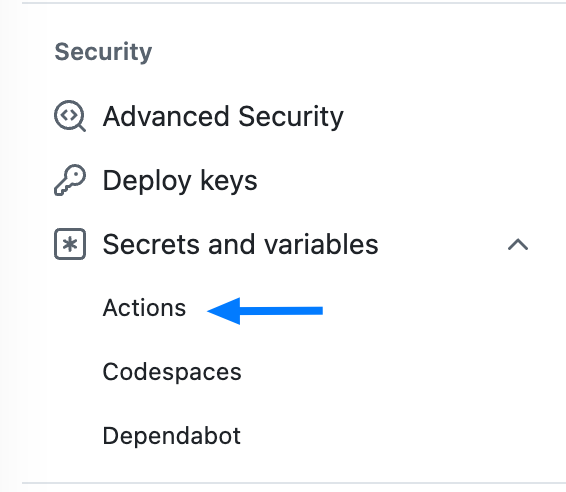
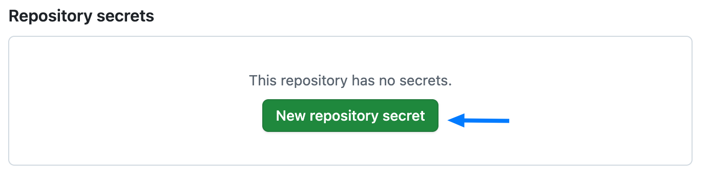
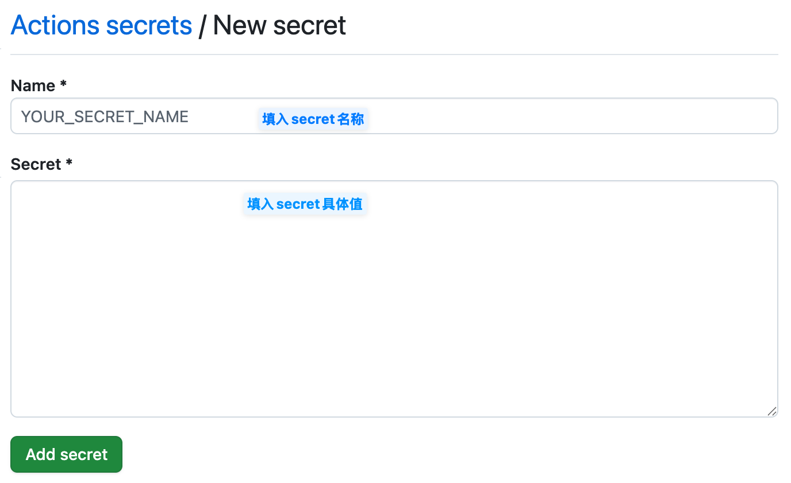
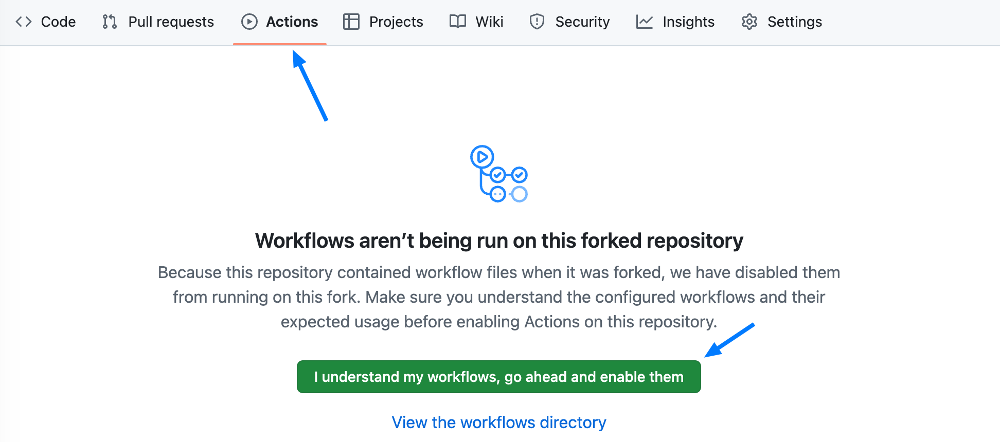

# ZotWatcher

[English Version](README.en.md)

ZotWatcher 是一个基于 Zotero 数据构建个人兴趣画像，并持续监测学术信息源的新文献推荐流程。本仓库每周四北京时间 07:00 在 GitHub Actions 上运行，生成 RSS/HTML 报告并邮件推送，也可本地手动执行。

当前研究配置包括主题、期刊、重点作者，以及 **18 篇种子的前向被引追踪、经典参考文献补漏、
语义与引文联合的可解释推荐**。每轮同步后更新画像，并记录跨周推送历史。
具体阈值、请求上限和失败恢复机制见 [引文发现说明](docs/citation-discovery.md)。

另已加入[研究助手六项功能](docs/research-assistant.md)：阅读反馈、研究方向覆盖诊断、
方法迁移卡、摘要方法作用线索、待确认作者/种子候选，以及版本/更正提醒。
按当前研究偏好，全部只使用标题、摘要及引文元数据，**不获取正文**。

最新增加[可靠检索与分问题推荐](docs/reliable-discovery.md)：长等待熔断、预算/缓存检查点、
独立语义发现、7个问题画像、多样性选择、合作组合、局部证据图和离线评估。没有人工评估集时
不声称准确率提升；限流或查询轮换时会明确报告覆盖不足。

## 功能概览
- **Zotero 同步**：通过 Zotero Web API 获取文库条目，增量更新本地画像。
- **画像构建**：对条目向量化，提取高频作者/期刊，并记录近期热门期刊。
- **候选抓取**：当前直连 OpenAlex/Crossref，结合主题、期刊、重点作者和引文关系；公共候选池配置保留但未启用。
- **去重打分**：结合语义相似度、时间衰减、引用/Altmetric、SJR 期刊指标及白名单加分生成推荐列表。
- **输出发布**：生成 `reports/feed.xml` 供 RSS 订阅，并通过 GitHub Pages 发布；同样可生成 HTML 报告或推送回 Zotero。

## 快速开始
1. 登录GitHub后，打开仓库页面 [ZotWatch](https://github.com/Yorks0n/ZotWatch)

2. 在顶部点击**Fork**按钮创建分支，将仓库复制到自己的GitHub账号下：**Fork - Create fork**

3. 到fork后的ZotWatch页面，点击设置（**Settings**），在设置页面左侧找到**Secrets and variables**，展开并点击下级的**Action**。
   

4. 点击右侧的**New repository secret**按钮，添加几个必要的Repository secrets
   

5. 添加几个必要的键值对，包括：

   - `ZOTERO_API_KEY`，此为获取 Zotero 数据库中现有个人信息所必须。登录 Zotero 网站的[个人账户](https://www.zotero.org/settings/)后，在 **Settings - Security - Applications** 处点击 **Create new private key**，其中 Personal Library 给予 Allow library access，Default Group Permissions 给予 Read Only 权限，保存获得 API。
   - `ZOTERO_USER_ID`，该 ID 可从上述 **Settings - Security - Applications** 处 **Create new private key** 按钮下方一行 `User ID: Your user ID for use in API calls is ******` 获取。
   - `CROSSREF_MAILTO`，邮箱地址，用于个人热门期刊补抓时的礼貌标注。
   - `OPENALEX_MAILTO`，仅在关闭统一公共候选池、回退到直连 OpenAlex 时需要。
   - 邮件推送还需要 `SMTP_HOST`、`SMTP_PORT`、`SMTP_USERNAME`、`SMTP_PASSWORD`、`SMTP_FROM`，
     以及收件人 `EMAIL_TO`（建议放在同一页的 **Variables** 标签，而不是写死在 workflow 里）。
     

6. 回到自己仓库首页，点击顶部**Settings**，在左侧找到**Pages**，在页面中为其**Source**选择**GitHub Actions**，使得生成的RSS页面直接发布到GitHub Pages。

   

7. 接下来点击顶部的**Actions**栏目，并确认开启GitHub Actins
   

8. 点击左侧**Weekly Watch & RSS**，默认情况下fork来仓库的Workflow是关闭状态，点击右侧Enable workflow激活。
   

9. 此时仓库会在每周四早上七点（北京时间）自动运行，要立刻运行请点击**Run workflow**（可勾选 `dry_run` 先演练）。首次运行需要全量生成向量数据库，会比较慢，可以点击**All workflows**查看运行状态。

   

10. 运行完后去 **Settings - Pages** 页面上可以看到自己的站点地址，此时直接访问此地址并不能打开，需要复制地址并在末尾加上`/feed.xml`，例如`https://[username].github.io/ZotWatch/feed.xml`，该地址可以导入 Zotero 的 RSS 订阅，或用于导入你喜欢的 RSS 阅读器。
       

11. 本项目的上游仓库会定期更新以修复错误/优化性能，因此假如你看到有更新提示，可以点击顶部的**Update branch**来更新到最新版。


## 本地运行
1. **克隆仓库并准备环境**
   ```bash
   git clone <your-repo-url>
   cd ZotWatcher
   mamba env create -n ZotWatcher --file requirements.txt  # 或使用 pip 安装
   conda activate ZotWatcher
   ```

2. **配置环境变量**
   在仓库根目录创建 `.env` 或 GitHub Secrets，至少包含：
   - `ZOTERO_API_KEY`：Zotero Web API 访问密钥
   - `ZOTERO_USER_ID`：Zotero 用户 ID（数字）
   可选：
   - `SUPABASE_PUBLISHABLE_KEY`：覆盖仓库内置的统一公共候选池只读 key
   - `ALTMETRIC_KEY`：用于获取 Altmetric 数据
   - `CROSSREF_MAILTO`：覆盖个人热门期刊补抓的联系邮箱
   - `OPENALEX_MAILTO`：仅在关闭统一公共候选池、回退直连 OpenAlex 时使用

3. **本地运行**
   ```bash
   # 配置自检（不联网，校验权重求和与优先级规则顺序）
   python -m src.check_config

   # 首次全量画像构建
   python -m src.cli profile --full

   # 日常监测（生成 RSS + HTML）
   python -m src.cli watch --rss --report --top 20

   # 只生成邮件、不发送，落盘到 reports/email-preview.eml
   python -m src.cli notify --dry-run
   ```

## 邮件推送
收件人来自仓库变量 `EMAIL_TO`（**Settings - Secrets and variables - Actions - Variables**），
多个地址用逗号或分号分隔；若不想公开地址，也可改存为同名 Secret。
SMTP 参数放在 Secrets：`SMTP_HOST`、`SMTP_PORT`、`SMTP_USERNAME`、`SMTP_PASSWORD`、`SMTP_FROM`。

邮件正文即当期完整报告（`multipart/alternative`），纯文本部分列出前 8 篇标题与链接，
附件只保留 `feed.xml`。历史推送保存在 `reports/` 并由 Pages 发布，入口 `archive.html`。

## 运行触发
- 定时：每周四北京时间 07:00（`.github/workflows/daily_watch.yml`）。
- 手动：Actions - **Weekly Watch & RSS** - Run workflow，可勾选 `dry_run` 只演练不推送。
- 代码改动由 `.github/workflows/ci.yml` 单独校验。**推送流程没有 `push` 触发器**：
  否则每次提交都会跑完整流程、发一封邮件，并把这批论文记为"已推送"，正式周推就不会再出现。

## 目录结构
```
├─ src/                   # 主流程模块
├─ config/                # YAML 配置，含 API 及评分权重
├─ data/                  # 画像/缓存/指标文件
│   └─ watch-state/       # 推送历史（纳入版本控制，防止重复推送）
├─ reports/               # 生成的 RSS/HTML 输出（历史报告纳入版本控制）
└─ .github/workflows/     # GitHub Actions 配置
```

## 自定义配置
- `config/zotero.yaml`：Zotero API 参数（`user_id` 可写 `$ {ZOTERO_USER_ID}`，将由 `.env`/Secrets 注入）。
- `config/sources.yaml`：统一公共候选池 API、各数据源开关、分类、窗口大小（默认 30 天）。
- `config/embedding.yaml`：语义模型。默认 `allenai-specter`（768 维、512 token、按引文图训练，
  面向"给定标题摘要找相似论文"）。换模型会改变向量维度，索引在下次运行时自动重建。
- `config/scoring.yaml`：权重、阈值与饱和参数。**每个打分分量都被压到 [0, 1]**，权重和为 1，
  因此总分也在 [0, 1]，`must_read` / `consider` 阈值跨轮次可比。
  `research_priorities` 首个命中的规则生效，因此系数必须自上而下递减——
  `python -m src.check_config` 会检查这一点。

## 阈值标定
换模型后相似度分布会变，跑一轮后在运行日志里查看：

```text
Score distribution over N ranked works: p50=... p75=... p90=... p99=... max=...
Label counts: {'must_read': .., 'consider': .., 'ignore': ..}
```

若 `must_read` 长期为 0 或过多，按 p90/p99 调整 `config/scoring.yaml` 的 `thresholds`。

## 常见问题
- **缓存过旧**：候选列表默认缓存 12 小时，可删除 `data/cache/candidate_cache.json` 强制刷新。
- **未找到热门期刊补抓**：确保已运行过 `profile --full` 生成 `data/profile.json`。
- **推荐为空**：先看报告顶部的漏斗（抓取 → 主题通过 → 去重后 → 推送）定位是哪一步卡住；
  再检查窗口天数、预印本比例限制，或调节 `--top` 与 `thresholds`。
- **本地报错找不到时区**：Windows 需要 `tzdata`（已列入 `requirements.txt`）；
  缺失时会退回固定 +08:00，不影响出图。

## 许可证
本项目采用 [MIT License](LICENSE)。
